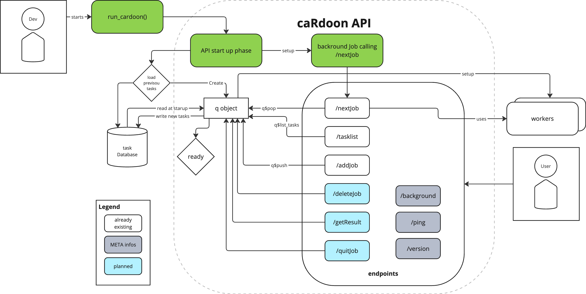

# :leafy_green: caRdoon - 0.0.0.9001 

A task queue API for R roughly based on functionality of [celery](https://github.com/celery/celery).

> "Cardoon leaf stalks, which look like giant celery stalks ..."

Source: [Wikipedia](https://en.wikipedia.org/wiki/Cardoon)

# Motivation

When building dashboard, calling an model API in the back-end is quite common. If the model takes a while to compute, most users want to know when there task is done or being processed. One solution is a task queue like [celery](https://github.com/celery/celery). Since this is sometime an overkill for small projects, I had the idea to build something similar. I came across this [blog post](https://www.tidyverse.org/blog/2019/09/callr-task-q/) and decided to wrap this all together into a small little package.

# Setup

The target setup looks like this:

# Ideas

First a small working package is planed, but there are already ideas floating around for improvements and enhancements. For example:

- [ ] adding a file/DB to store results
- [ ] integrate testing
- [ ] provide docker container
- [ ] ...

# Notes

Source image for the hex-icon from [Flaticon](https://www.flaticon.com/free-icons/celery).

